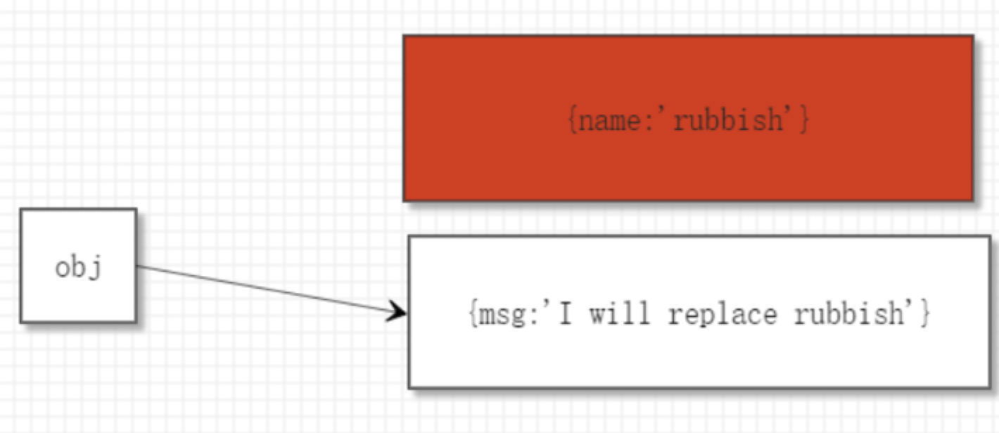
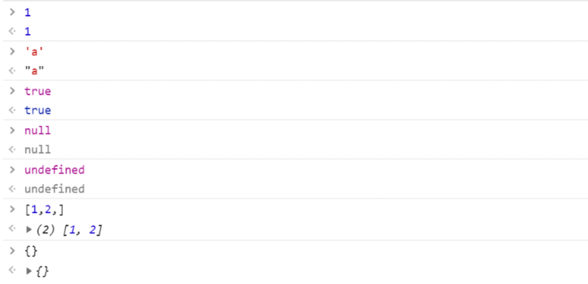

<!--
<table><tr><td bgcolor=#ff5722 color=#FFFFFF>test</td></tr></table> -->

## <font color=#161100 face="黑体">数据类型</font>

---

### 原始值

`number、string、boolean、undefined、null`

数字类型加上前缀表示不同进制

    0：var num = 010 表示八进制 8
    0x: var num = 0x10 表示16进制 16
    0b: var num = 0b10 表示二进制 2

字符串类型

    在字符串内使用特殊字符用转义字符: var str = ' hello 'world'
    \t: 制表符用于缩进
    \n：换行符用于换行

### 引用值

`object、function`

## <font color=#161100 face="黑体">二、数据类型的判断</font>

通常情况下判断数据的类型一般使用`typeof`关键字, 其返回值:

`"number"、"string"、"boolean"、"undefined"、"object"、"function"`

## <font color=#161100 face="黑体">变量</font>

变量：变量是一块内存空间，用于存储数据

    什么是内存？

    计算机组成：CPU、内存、硬盘、输入输出设备

    内存：读写速度快，易丢失

    硬盘：读写速度慢，数据持久化

    计算机程序的运行速度只与内存有关

**弱数据类型的语言的特点**: 在 js 中变量的类型是可以变化的, 上一秒是数字下一秒可能就会是字符串

**变量声明注意点**: 变量名只能以英文字母、\_、$开头,其他位置可以出现数字、英文字母、_、$

    变量的声明和赋值可以放在一条语句内书写，本质就是语法糖。

## <font color=#161100 face="黑体">变量与对象</font>

---

**获取对象属性值**

    对象名.属性名

**修改对象属性值**

    对象名.属性名 = 属性值

    eg: user.name = 'seo'，如果没有这个属性会自动赋值；

**删除对象属性**

    delete 对象名.属性名

```js
var user = {
  name: "steven",
};
console.log(user.name); // 'steven'
user.age = 19;
console.log(user); // { name: 'steven', age: 19 }
delete user.name;
console.log(user); // { age: 19 }
```

    当读取的属性不存在时，值为undfined

    当读取的对象不存在时，对象的值为（undfined或null）,报错

**属性表达式**

    对象名["属性名"] ，可读可写

适用场景: 属性名中包含特殊字符（不符合变量的命名规范时），如：

```js
var user = {
  "@3^&*_": "666",
};

// 只能使用[]访问
// user."@3^&*_" => 会报错

console.log(user["@3^&*_"]); // 666
```

**注: 在 JS 中，对于属性的要求并不严格，属性名可以是任何形式的数据（`number、string、boolean、undefined、null、arrary、object`），但宿主环境最终都会转换为字符串（数组会解构，对象会直接调用 toString 方法）**

```js
var user = {
  name: "steven",
};

// <!--方式1-->
user.true = 10;
console.log(user); // { name: 'steven', true: 10 }

// <!--方式2-->
user["true"] = 20;
console.log(user); // { name: 'steven', true: 20 }
```

数组和对象的转换方式略有不同

```js
var user = {
  name: "steven",
};
user[[1, 2, 3, 4]] = 10; //  数组
console.log(user); // { name: 'steven', '1,2,3,4': 10 }

user[{}] = 90; // 对象
console.log(user); //{ name: 'steven', '1,2,3,4': 10, '[object Object]': 90 }
```

**review**

```js
var obj = {};

obj[0] = 123; //  会转换为字符串

obj["0"] = 234;

console.log(obj[0], obj["0"]); // 234 234 二者本质相同,操作的是一个变量
```

## <font color=#161100 face="黑体">全局对象</font>

---

JS 的大部分宿主环境, 会提供一个特殊的对象, 在 JS 代码中可以直接访问,该对象被叫做全局对象,在浏览器环境中, 全局对象为 window, 表示整个浏览器窗口;

**全局对象中所有属性可直接访问,不需要加上全局对象名.**

```js
console.log(alert === window.alert); // true
```

**在浏览器环境中,开发者定义的全局变量,都会成为 window 对象上的属性**

```js
console.log(window.abs); // undefined => window没有abs属性

var abs = 0;

console.log(window.abs); // 0  window.abs可以访问到abs属性
```

**如果 window 中有同名变量且开发者定义了的变量且赋值了,那么 window 中的同名变量被覆盖**

```js
var alert = "123"; // window对象中有alert属性为函数

console.log(alert); // 123    window.alert被覆盖
```

**如果 window 中有同名变量但开发者定义了的变量且没有赋值(只是声明了一个与 window 对象一个属性同名的变量), 则 window 中的属性不会被覆盖**

```js
var alert;

console.log(window.alert); // ƒ alert() { [native code] }
```

**window 上有一个 name 属性, 该属性是 window 自带的, 为一个空字符串, 并且无论给这个属性赋成什么值都会被转换为字符串**

```js
console.log(name, typeof name); // '' 'string'

console.log(window.name === name); // true

var name = undefined;

console.log(window.name, typeof name); // 'undefined' 'string'
```

## <font color=#161100 face="黑体">引用类型</font>

---

**变量赋值**

```js
var a = "123";
var b = a;
b = "456";
console.log(a, b); // '123' '456'  ==> 不会改变

var obj1 = {
  name: "123",
};
var obj2 = obj1;
obj2.name = "456";
console.log(obj1.name, obj2.name); // '456' '456' ==> 会改变
```

<font color=#ff5722 face="黑体">所有的变量赋值操作都是复制粘贴的过程</font>

    对于原始值: 变量占用的内存直接存储数据值(在赋值操作中将占用的内存直接赋值给另一个变量, 二者变量的占用的内存空间存储的数据相同, 确属于不同的内存空间), 所以修改其中一个变量另一个不会改变;

    对于引用值: 会占用两个内存空间, 一个是变量占用的空间用于存放指向引用值的地址, 另一个内存空间用于存放引用值真实值(在赋值操作中, 会将变量占用的内存空间赋值, 也就是存放地址的那个内存, 二者地址相同, 共同指向一个内存空间, 修改其中一个变量的属性另一个也会改变).

```js
var obj1 = {
  name: "sss",
};
var obj2 = obj1;
obj2 = {
  name: "111",
};
console.log(obj1.name, obj2.name); //sss 111
```

```js
var obj3 = {
  name: "sss",
  sub: {
    age: 10,
  },
};
var obj4 = obj3;
obj4.sub = {
  age: 100,
};
console.log(obj3.sub.age, obj4.sub.age); // 100 100
```

```js
var obj5 = {
  name: "sss",
  sub: {
    age: 10,
  },
};
var temp = obj5.sub;
var obj6 = obj5;
temp = {
  age: 100,
};
console.log(obj5.sub.age, obj6.sub.age); // 10 10
```

```js
var obj7 = {
  name: "sss",
  sub: {
    age: 10,
  },
};
var temp = obj7.sub;
var obj8 = obj7;
obj8.sub = {
  age: 100,
};
console.log(obj7.sub.age, obj8.sub.age, temp.age); // 100 100 10
```

## <font color=#161100 face="黑体">垃圾回收</font>

---

垃圾回收器会定期发现内存中无法访问到的对象, 该对象称为垃圾, 垃圾回收器会在合适的时机将其占用的内存释放.

```js
var obj = {
  name: "rubbish",
};
obj = {
  msg: "we will replace rubbish",
};
```

下面这条赋值语句执行之后, 上面的对象 `{name:'rubbish'} `变为垃圾(无法通过某个变量内的地址找到这个对象即为垃圾）.



### **垃圾回收内部算法**

基本的垃圾回收算法称为"标记-清除"，定期执行以下“垃圾回收”步骤:

    1. 垃圾回收器获取根,并‘标记’(记住)它们;
    2. 然后垃圾回收器访问并‘标记;所有来自根的引用;
    3. 垃圾回收器访问标记的对象并标记它们的引用,所有被访问的对象都被记住，以便以后不再访问同一个对象两次;
    4. 以此类推，直到有未访问的引用(可以从根访问)为止;
    5. 除标记的对象外，所有对象都被删除。

> 注：标记的是垃圾。

这就是垃圾收集的工作原理, JavaScript 引擎应用了许多优化 ,使其运行得更快, 并且不影响 JavaScript 执行.

### **垃圾回收优化**

    - 分代回收——对象分为两组:"新对象"和"旧对象"。许多对象出现，完成它们的工作并迅速结，它们很快就会被清理干净。那些活得足够久的对象，会变"老"，并且很少接受检查。

    - 增量回收——如果有很多对象, 并且我们试图一次遍历并标记整个对象集, 那么可能会花费一些时间, 并在执行中会有一定的延迟.因此, 引擎试图将垃圾回收分解为多个部分.然后, 各个部分分别执行.这需要额外的标记来跟踪变化, 这样有很多微小的延迟, 而不是很大的延迟.

    - 空闲时间收集——垃圾回收器只在CPU空闲时运行, 以减少对执行的可能影响.

## <font color=#161100 face="黑体">表达式</font>

---

> #### 表达式 = 操作符 + 操作数

每一个表达式都有一个运算结果, 这个结果叫做 `返回值`，返回值的类型叫做 `返回类型`, 所有的表达式都可以当做数据使用, 即将表达式（的返回值）作为操作数, 再进行运算。

任何代码都可以看成一个表达式且都有返回值, 甚至单独的一个字符串/数组/数字/变量/变量的声明等.



**由此我们可以得出，JS 中的代码是由各种表达式构成，利用表达式的返回值进行运算**

## <font color=#161100 face="黑体">运算符的返回值及类型</font>

---

### = 运算符

> 该运算符（也可以叫表达式）, 赋什么值就返回什么值, 赋的值的类型是什么返回值的类型就是什么.

```js
var a;
console.log((a = 1)); // 返回值为1
console.log(typeof (a = 1)); // 返回类型为 'number'

// 利用这个特性就可以连续赋值
var b = (c = 1);
// 上面的代码就相当于
//  c = 1 的返回值为 1 再赋值给 b
```

### . 运算符

> 属性访问表达式, 返回属性的值.

### [] 运算符

> 属性访问表达式, 返回属性的值

### () 运算符

> 函数调用表达式, 返回值取决于函数的 return 的值

### console.log()函数

> console.log()函数的返回值为 undefined, 返回值类型为 undefined

```js
console.log(console.log()); //undefined
console.log(typeof console.log()); //undefined
```

### 声明+赋值表达式

> 声明+赋值表达式返回值为 undefined, 类型为 undefined（仅可以在浏览器中测试）, 本质是因为变量声明表达式的返回值为 undefined

**Chrome 浏览器的环境是 REPL 环境，Read-Eval-Print-Loop，读-执行-打印-循环，当在浏览器书写代码时，除了会运行代码，还会输出表达式的返回值**

## <font color=#161100 face="黑体">算数运算符</font>

---

### 数学运算符

> +、-、\*、/: 加减乘除

> +、-: 正负

> %: 求余

> ++、--: 自增、自减

> \*\*: 幂运算

#### <font color=red face="黑体">注意事项</font>

    1. 数字的运算是不精确的
    2. 除数为0
        - 被除数为正数，结果为Infinity
        - 被除数为负数，结果为-Infinity
        - 被除数为0，结果为NaN（Not a Number）
    3. 求余(%)：余数的正负与被除数相同
    4. isNaN()用于判断一个数据是否是NaN,返回boolean
    5. isFinite()用于判断一个数据是否是有限的,返回boolean

### 自增/自减运算符

> x++：将变量 x 自增加一，该表达式返回 x 自增之前的值

> ++x：将变量 x 自增加一，该表达式返回 x 自增之后的值

### 比较运算符

> 大小比较

    - 两个字符串比较, 比较的是ascii码

    - 一个字符串与另一个不是字符串的原始值比较, 将二者转换为数字进行比较

    - 一个对象与另一个任意数据类型进行比较，将对象转化为字符串，也就是'[object Object]'

> 相等比较

    普通相等比较（==、!=)
        case1:两边数据类型相同：
            (1). 直接比较, 如果是对象比较地址;
        case2:两边数据类型不相同：
            (1). null等于undefined, 但二者不等于任何数据类型;
            (2). 其他原始类型，转换为数字;
            (3). NaN不等于任何数据类型, 包括自身;
            (4). 对象比较转换为原始类型, 也就是字符串'[object Object]';
    严格相等比较（===、!==）: 比较数据+类型

> 逻辑运算符： && 的优先级高于 ||

### <font color=red face="黑体">注意事项</font>

#### 运算符的优先级

    最高: ++/--
    其次: *、/、% 
    最低: +、- 

#### 优先级的运算细节(容易混淆)

    - 从左到右依次查看
    - 如果遇到操作数，将操作数取出赋值
    - 如果遇到两个相邻的运算符，如果左边的运算符优先级大于等于右边的运算符直接，直接运算左边的表达式

#### 隐式类型转换

> 除+（加号）以外的数学运算符

  **原始类型：将原始类型转化成数字再进行运算**

  boolean : ture ===> 1，false ===> 0

  string：如果内部是一个数字，则转化为对应的数字，如果是一个非数字，转化为 NaN（可识别 Infinity），对于字符串的转换会忽

  两边的空格，空字符串转换为 0

  NaN：NaN 虽然是一个数字但是与任何数字进行转换运算结果都是 NaN

  null：转化为 0

  undefined：转化为 NaN

  **对象类型：将对象类型转化成字符串，在将字符串转换成数字进行运算**

  处理流程：任何对象 => "[object Object]" => NaN

> +（加号）

  规则 1：如果两边都是字符串，加号代表字符串拼接

  规则 2：如果一边是字符串，将不是字符串的一边转化为字符串

  规则 3：如果两边都没有字符串，一边有对象，将对象转换为字符串（'[object Object]'）再按照规则 2 进行转换

  规则 4：其他情况与 " 除加号以外运算符 " 转换的规则一样

### 细节 

> 类型转换不会影响类型本身

- void 运算符：

  作用：运算表达式返回 undefined

  用法：void 表达式 或 void(表达式)

- 逗号运算符

  用法：表达式 1，表达式 2，表达式 3

  作用：依次运行表达式 1，表达式 2，返回表达式 3 的值

### JS 数据未解之谜

> 为什么 JS 小数不精确？

  计算机用二进制进行运算，而十进制小数转化为二进制后，可能是无限循环小数，但计算机的存储能力有限，会丢失一些数据。

> JS 如何存储数据？

  存放数字的方式有两种，整数法和浮点法，而 JS 无论是整数还是小数都用浮点法存放，这也是导致整数计算不一定精确的原因。浮点法存放数据又分为单精度、双精度，而 JS 采用的是双精度 64 位的 IEEE 754 存储标准。

## <font color=#161100 face="黑体">位运算</font>
---

位运算: 将一个整数的二进制格式进行运算.

在JS中如果一个数字进行位运算, 那么先将这个数字转换为整数，并且是32位整数存储格式.（与JS本身采用双精度64位存储略有不同）
> NaN、Infinity、-Infinity转换为0

### 1. 与运算 &
运算规则：两个整数比较，如果都为1则结果为1，否则为0。**同1为1**

### 2. 或运算 |

运算规则：两个整数进行比较，如果有一位为1，则结果为1，否则为0。**有1为1**

### 3. 非/否运算 ~

运算规则：**整数变成二进制按位取反**

>非运算快捷方法：-(非运算的数字) - 1

```js
~1 = -1 - 1 = 0
~2 = -2 - 1 = -3 
```
#### <font color=red face="黑体">非运算应用-快速取整</font>
> 优势：位运算的执行速度非常快

> 取整方法：~~数字

```js
~~1.333 = 1
~~8.9   = 8
```
### 4. 异或运算 ^

两个整数进行比较，相同取0，不同取1


#### <font color=red face="黑体">非异或运算应用-交换变量</font>
> 交换a、b

```
eg1：只用加减
var a = 1, b = 2;
a = a + b;
b = a - b; // b = a
a = a - b; 

eg2：异或运算
var a = 2, b = 3;
a = a ^ b; // 10 ^ 11 = 01 = 1 
b = a ^ b; // 01 ^ 11 = 10 = 2
a = a ^ b; // 01 ^ 10 = 11 = 3
```

### <font color=red face="黑体">位运算的应用-位的叠加(位的开关)</font>
有这样一个权限对象，如下：
```
var power = {
    'read': 0b001,
    'write': 0b010,
    'modifiy': 0b100
}
```
#### 添加权限 |
> 原理：每一个权限只占一位且唯一，做或运算就会给对应的位上赋值为1(因为该运算的特性就是有1为1)
```
// 001 | 010 => 011 => 3
var p = power.read | power.write; 
console.log(p) // 3
```
#### 查看权限 & 
> 原理：同1为1,只有对应的位上有该权限才会返回1，否则都会为0
```js
//  011 & 001 => 001 => 1
p & power.read ? console.log('read') : console.log('no read'); // read
// 001 & 010 => 010 => 2
p & power.write ? console.log('write') : console.log('no write'); // write
// 011 & 100 => 000 => 0
p & power.modifiy ? console.log('modifiy') : console.log('no modifiy'); // no modifiy
```
#### 删除权限 ^
> 原理：先加上对应的权限，在进行去除，这是为了防止之前没有这个权限，导致与运算结果错误
```
// 011 | 100 => 010
p = p | power.read ^ power.read;
console.log(p) // 2
```
-----
### 右移 
> 相当于当前数字除2 有溢出的风险

-  无符号右移 >>
-  有符号右移 >>>
### 左移 
> 相当于当前数字乘2

- 无符号左移 <<
- 有符号左移 <<<

---

### 求模和求余的区别 
>二者都是用%来运算，但是在js中%只是代表求余，js中没有求模运算符
#### 计算公式
```math
res = x - n * y

n表示x/y的商
```
二者的计算公式相同，唯一不同的就是n的计算方式
>  求模 n = x/y向零取整（小数直接舍去）

> 求余 n = x/y向下取整（向数轴左边的方向取整）

 由此可以得出，求余结果符号与被除数相同，求模结果符号与除数相同


